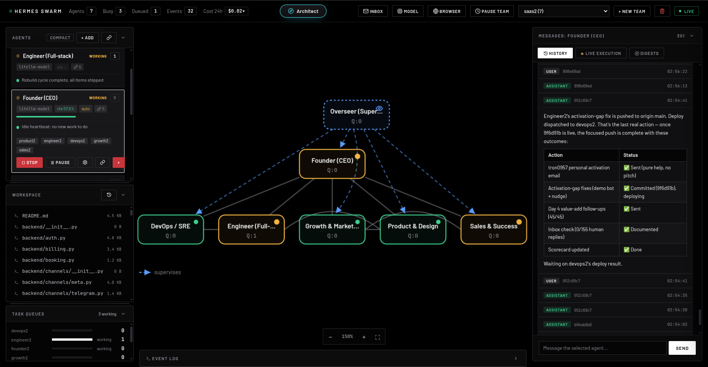

<div align="center">

# SynthPulse Swarm

**Mission control for a self-hosted swarm of AI agents. By Synthwave Solutions.**

A team of full [Hermes](https://github.com/NousResearch/hermes-agent) agents that
browse, build, and publish, collaborating 24/7 on your own hardware, with one
real-time console to command them. Part of the SynthPulse Agentic Workstation.

[Getting started](docs/getting-started.md) | [Deploy on a VPS](docs/deploy-vps.md) | [MIT licensed](#license)

</div>



## Quick start

> **Have an AI coding agent?** Paste one of these prompts into **Claude Code,
> Codex, opencode, or Hermes itself** and it'll install and set up the whole swarm
> for you, clone, dependencies, provider, and first run.

<details>
<summary><b>📋 Local install prompt</b>, set it up on this machine</summary>

```text
Install and run SynthPulse Swarm on this machine for me.

SynthPulse Swarm (https://github.com/Synthwave-Solutions/synthpulse-swarm) is a
self-hosted multi-agent server with a real-time dashboard.

1. Check Python 3.11+ (or Docker). If missing, tell me before installing system packages.
2. If ./hermes-swarm doesn't exist, clone the repo there. Run the installer
   non-interactively: `bash install.sh --no-run`. It auto-skips the interactive
   wizard when there's no TTY, so it won't hang. (Add `--no-browser` only if the
   Chromium download fails, everything else still works.)
3. Check whether a provider is already configured, run `.venv/bin/hermes-swarm doctor`.
   If it already shows a model (e.g. an existing `~/.hermes` setup), ADOPT IT,
   don't ask me for keys, the swarm reuses it automatically. Skip to step 5.
4. Only if NO provider is configured, ask me for:
     - provider (e.g. openai, anthropic, or "custom" for an OpenAI-compatible / proxy endpoint)
     - model name, API key, and base URL (base URL only for custom/proxy, e.g. http://localhost:4000/v1)
   Then set it with the supported NON-interactive command (do NOT edit Python internals):
     .venv/bin/hermes-swarm set-model --provider <p> --model <m> [--base-url <url>] --api-key <key>
   Then tell me that `set-model` only sets the model, for web-search, vision,
   browser providers, memory, and reasoning-effort customization I can run the
   full wizard myself anytime: `.venv/bin/hermes-swarm setup`. Offer to run it.
5. Verify: `.venv/bin/hermes-swarm doctor` (a "backend not reachable" warning is
   fine if my model server isn't running yet).
6. Scaffold a team and start the server detached:
     .venv/bin/hermes-swarm init
     .venv/bin/hermes-swarm up --detach   # daemonizes and returns; don't background it yourself
   It prints the URL once /health is up. Confirm with `.venv/bin/hermes-swarm status`.
   (Use `up --detach`, NOT `nohup … &`, backgrounding it from your shell means it
   dies when your session/process group ends.)
7. Tell me how to manage it and build my first team:
     - open the dashboard at http://127.0.0.1:8000 and use the Architect
     - check status:  .venv/bin/hermes-swarm status
     - stop it:       .venv/bin/hermes-swarm down
     - customize more: .venv/bin/hermes-swarm setup

Keep my API key local, don't commit it or send it anywhere.
```

</details>

<details>
<summary><b>📋 VPS install prompt</b>, deploy it on a server, exposed safely</summary>

```text
Deploy SynthPulse Swarm on this VPS, exposed safely over HTTPS.

SynthPulse Swarm (https://github.com/Synthwave-Solutions/synthpulse-swarm) is a
self-hosted multi-agent server. Its agents can run terminal commands as the
server user, so containment and auth matter. Please:

1. Read docs/deploy-vps.md in the repo and follow its hardened path. Prefer the
   Docker route so the agents' terminal access stays contained.
2. Clone the repo and bring it up with Docker Compose (restart: unless-stopped).
3. Generate a strong SWARM_API_KEY and set it, it must guard every endpoint and
   the WebSocket. Show it to me once and store it somewhere I can find it.
4. Configure the LLM provider via `hermes setup` against the shared config,
   PAUSE and ask me for the provider + API key.
5. Put it behind a TLS reverse proxy (Caddy or nginx) for my domain, ask me for
   the domain/subdomain, with automatic HTTPS.
6. Lock down the firewall: only 80/443 and SSH open; do NOT expose the raw app
   port.
7. Verify: GET /health returns ok, and the dashboard loads over HTTPS and prompts
   for the API key.
8. Report back the URL, where the API key is stored, and how to watch logs
   (docker logs / journald).

Ask me before anything destructive. Never print my API key or provider key into a
file that could be committed.
```

</details>


**Or do it yourself, macOS & Linux, one line.** 

```bash
bash <(curl -fsSL https://raw.githubusercontent.com/Synthwave-Solutions/synthpulse-swarm/main/install.sh)
```


<details>
<summary><b>Install with Docker</b> <b> or from a clone</b> </summary>

```bash
# Docker
git clone https://github.com/Synthwave-Solutions/synthpulse-swarm hermes-swarm && cd hermes-swarm
docker compose run --rm swarm hermes-swarm setup  
docker compose up --build
```
or
```bash
# From a clone 
git clone https://github.com/Synthwave-Solutions/synthpulse-swarm hermes-swarm && cd hermes-swarm
bash install.sh
```

</details>


## Features

**Teams & collaboration**
- Multiple teams, each with its own shared `project/` directory and a
  `workspace.md` brief injected into every member's context.
- Peer-to-peer messaging between teammates; connections are bidirectional and
  scoped to a team (`send_peer_message`).
- Supervisor agents that periodically review teammates' transcripts and nudge
  anyone who has stalled or is idle while owing work.
- A shared record of the team's decisions, actions, delegations, and milestones -
  with rolled-up summaries so long-term memory survives compaction.

**Each agent is a full Hermes agent**
- A real terminal and code execution, a headless Chromium browser (enhanced with custom tools: coordinate clicks `browser_click_xy`, typing `browser_keys`, multi-step macro `browser_steps`, and VLM grounding `browser_locate`), and read/write access to the team's filesystem.
- Web research out of the box: `web_search` + `web_extract`, using a configured
  Hermes backend (Firecrawl/Tavily/Exa/…) if present, else a built-in fetcher
  (`httpx`, or optional crawl4ai for JS-heavy pages).
- Per-agent overrides for model, provider, tools, reasoning effort, sampling,
  iteration limit, and soul/role - all editable live, no restart.
- Each agent runs in its own isolated Hermes home, so memory, sessions, and
  SOUL.md never cross-contaminate (and your personal `~/.hermes` is untouched).

**Autonomy & scheduling**
- Mark one agent **autonomous** and it self-wakes on a heartbeat interval to push
  the mission forward without waiting for a task.
- Cron wake-ups per agent - 5-field cron, `@hourly`/`@daily`/`@weekly`/`@monthly`
  shortcuts, or `@every 30m` intervals.
- One-shot and bounded schedules (`max_runs`) that auto-stop, so a "do this once
  tomorrow" job doesn't recur forever; agents self-schedule via `schedule_wakeup`
  / `cancel_wakeup`, with duplicate wake-ups collapsed automatically.
- Per-agent SQLite task queue; in-flight tasks are recovered and resumed across
  restarts.

**Reliability & self-correction**
- Infra failures (proxy down, billing, timeouts) are detected and held with
  exponential backoff - work is paused, not lost, and retry budgets are spared.
- A per-task retry budget that dead-letters tasks which keep failing, so nothing
  silently zombies.
- A swarm-wide loop detector that catches A↔B ping-pong and team stalls and
  injects a corrective nudge.
- Automatic context compaction (Hermes' compressor, configured per agent) plus
  tool-output caps and stale-tool-result aging to keep context bounded.
- `recall_decisions` lets an agent retrieve its past decisions to pivot strategy
  instead of repeating a failed approach.

**Human-in-the-loop**
- A human **inbox**: agents ask for a decision, a credential, or an approval and
  resume the moment you answer (`ask_human`).
- **Embedded browser takeover** - clear a login, CAPTCHA, or 2FA inside the
  agent's live browser right in the dashboard via a CDP screencast, working even
  on a display-less VPS.
- Self-aware agents read their own config/telemetry and *propose* changes
  (`request_config_change`) for you to approve or reject.
- Pause/resume a single agent or an entire team's agents at once.

**Cost & safety controls**
- Per-team **daily USD budget** that auto-pauses agents at the cap (in-flight work
  held, not failed) and resumes at 00:00 UTC, with **Raise limit** / **Resume
  anyway** overrides.
- A token-cap fallback for models with no known price; per-turn token and cost
  tracking throughout.
- A per-team **credentials** store on disk with `0600` permissions - referenced by
  name, never echoed back, with purpose validation to prevent prompt leakage.
- A single `SWARM_API_KEY` that, when set, guards **every** HTTP endpoint *and* the
  live WebSocket; the dashboard prompts for it once.

**Dashboard & observability**
- Live execution view - watch each agent think → call a tool → answer in real time.
- A network graph of peer and supervisor relationships.
- A workspace file browser to read the team's shared project from the UI.
- Per-agent telemetry and config editing, cost badges, budget banners, and a
  streaming event log.
- A `/health` endpoint (liveness for anyone; full uptime/queue/backend picture for
  an authenticated caller) to point an uptime monitor at.

**The Architect**
- A built-in AI team builder that knows the whole framework and has web search to
  ground its suggestions.
- Proposes a team - agents, roles, links, and a shared brief - then builds it on
  your approval, and edits existing teams from chat ("add a QA agent to acme").

**Deployment & operations**
- One-command `install.sh`, Docker + compose, or pip - whichever fits your machine.
- A `hermes-swarm` CLI (`up` foreground/detached, `down`, `status`, `setup`, `set-model`, `init`, `doctor`) where `doctor` pinpoints a bad
  install (Hermes, model, Chromium, compat seams).
- A systemd unit example, stdout logs, and optional on-disk rotating logs
  (`SWARM_LOG_FILE`).
- Configure providers natively with `hermes setup` (40+ providers) **or** route the
  whole swarm through one OpenAI-compatible / LiteLLM proxy (`SWARM_LLM_*`).
- All state under `SWARM_DATA_DIR` with rotating config backups; built on Hermes,
  which it tracks automatically via a compatibility self-check.

## Hosting on VPS? 
See **[Deploy on a VPS](docs/deploy-vps.md)** 
## License

Released under the [MIT License](LICENSE).
